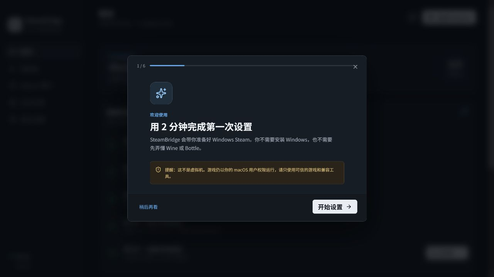
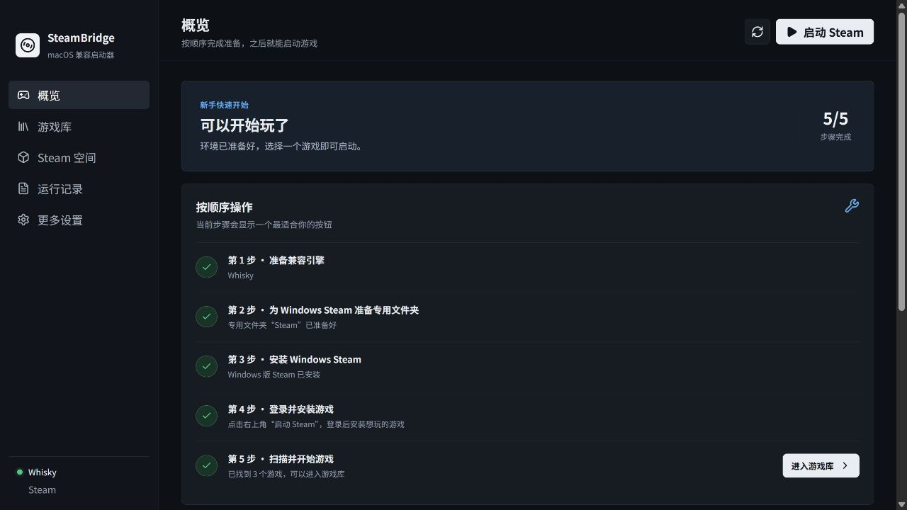
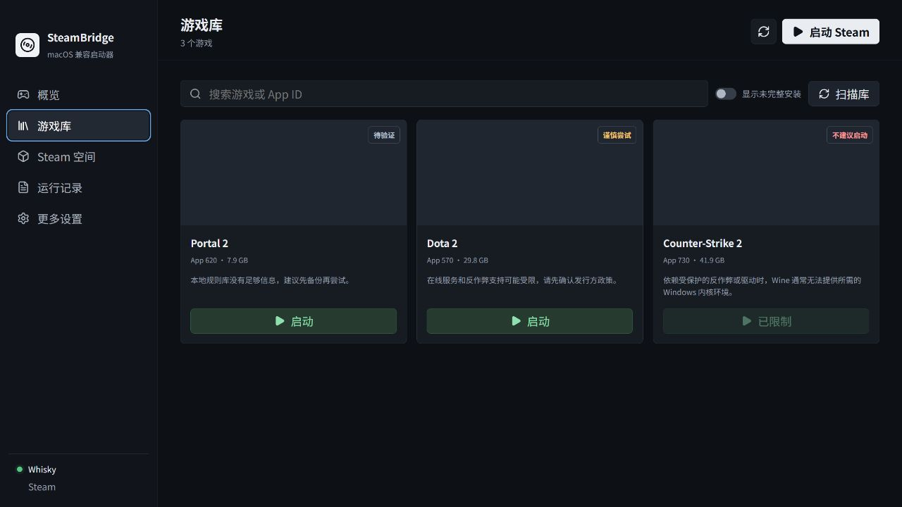
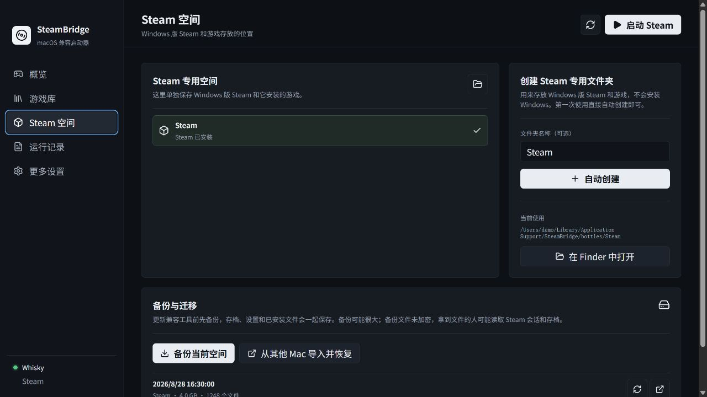

# SteamBridge

SteamBridge 是面向 macOS 的 Windows Steam 游戏兼容启动器。它不创建 Windows 虚拟机，而是调用本机已有的 Wine、WhiskyWine、CrossOver Wine 或其他兼容引擎，在独立 Wine prefix（Bottle）中安装 Windows 版 Steam 并启动游戏。

通俗地说：它可以让一部分“只有 Windows 版本”的游戏在 Mac 上试着运行，但不能保证全部成功。需要 Windows 内核反作弊、特殊驱动、某些 DRM 或不兼容图形 API 的游戏通常仍然不能玩；游戏库中的提示只是风险判断，真正结果还取决于当前 Mac、引擎和游戏版本。

> 当前版本是社区 MVP。兼容提示是保守的本地规则，不代表 Valve、Apple、游戏发行方或兼容引擎厂商的官方支持结论。

## 发布状态与下载说明

当前版本 `0.1.0` 已完成主要功能、自动化检查和安全边界测试，但还不是经过 Apple 签名、公证和多台真实 Mac 验收的稳定版。Windows 开发环境已通过 Lint、46 项自动化测试、TypeScript/Vite 构建和高危依赖审计；当前工作环境不能执行 `codesign`、`spctl`、`stapler` 或真实 macOS 安装测试。

上传到 GitHub 后，推荐从 **Actions → Package macOS → Artifacts** 下载测试包：Apple 芯片选择 `SteamBridge-arm64`，Intel Mac 选择 `SteamBridge-x64`。这些包是未签名验证包，首次打开可能被 Gatekeeper 拦截；不要把它们当作已经公证的正式安装包。只有配置 Apple Developer ID Secrets 并通过 `release-macos.yml` 的签名、公证和安装验收后，才会发布正式 Release。

## 一句话判断：这软件能不能让我玩 Windows-only 游戏？

**有机会，但绝对不能保证。** 它更适合先尝试老一些的单机游戏和常见 DirectX 游戏；依赖 Windows 内核反作弊、特殊驱动、VR/USB、某些 DRM 或第三方启动器的游戏通常不能玩。游戏库的“待验证”只表示本地规则库没有结论，不表示兼容。

| 类型 | 预期 | 说明 |
| --- | --- | --- |
| 常见 DirectX 的单机游戏 | 可能可以 | 仍取决于 Mac 芯片、macOS、引擎和游戏更新 |
| 有独立启动器或联网服务 | 谨慎尝试 | 登录、更新和 DRM 可能在 Wine 中失败 |
| Vanguard、Windows 内核驱动、内核级反作弊 | 通常不行 | Wine 没有 Windows 内核环境，SteamBridge 不会绕过它 |
| 特殊显卡、USB、VR 或驱动要求 | 通常不行 | macOS/Wine 没有对应的 Windows 驱动 |

## 示例截图

以下截图来自浏览器演示模式，只展示界面，不连接真实 Steam 账号、文件夹或本机进程。游戏封面受网络策略影响时可能为空白。









## 已实现

- 检测 macOS、Apple Silicon、Rosetta 2、Homebrew 和常见 Wine 引擎
- 创建、发现、选择和打开隔离 Bottle
- 从 Steam 官方 CDN 下载并校验 `SteamSetup.exe`
- 在当前 Bottle 中安装和启动 Windows 版 Steam
- 解析 `libraryfolders.vdf` 与 `appmanifest_*.acf`，扫描多个 Steam 库
- 展示每个游戏的安装状态、磁盘占用和保守兼容提示
- 对已知内核级反作弊受限游戏阻止启动
- 提供引擎/Bottle 设置、实时操作进度和本地诊断日志
- 启动失败自动诊断：权限、图形 API、缺少 DLL、Steam/游戏启动器、反作弊或未知原因
- 提供 Steam 专用空间备份、恢复、导出和跨 Mac 导入迁移；恢复不会覆盖当前空间
- 内置 Wine、Homebrew、Whisky、CrossOver 和 Rosetta 2 官方安装说明
- 提供 macOS ARM64 与 x64 的 GitHub Actions 打包工作流
- 默认移除 Bottle 的 `Z:` 主机根目录映射，并隔离 Wine 的 HOME、XDG 配置和临时目录
- 对 Steam 安装器执行官方域名、大小、PE 结构和 SHA-256 校验
- 对库路径、符号链接、IPC 主 frame、权限请求和外部打开路径做边界校验

## 重要限制

SteamBridge 不能也不会绕过反作弊、DRM 或游戏封禁策略。依赖 Windows 内核驱动的游戏通常无法通过 Wine 运行。Vanguard 必须使用 Windows 内核环境；BattlEye 和 Easy Anti-Cheat 只有在发行方为 Wine/Proton 启用支持时才可能工作。某些游戏能进入单人模式，但无法加入受保护的在线服务器。

图形兼容性取决于引擎提供的 DirectX 到 Metal/Vulkan 转换、macOS 版本、芯片架构和游戏更新。标记为“待验证”只表示本地规则库没有判定结果，不表示已兼容。详见 [兼容性说明](docs/compatibility.md)。

## 本地开发

要求 Node.js 22 和 npm。实际运行 Steam/Bottle 功能要求 macOS 12 或更高版本。

```bash
npm install
npm run dev
```

质量检查：

```bash
npm run check
```

仅生成前端生产资源：

```bash
npm run build:ui
```

## macOS 打包

必须在 macOS 上执行 Electron 的 macOS 打包：

```bash
npm ci
npm run build:mac -- --arm64
npm run build:mac -- --x64
```

产物写入 `release/`。仓库中的 `.github/workflows/package-macos.yml` 会对 ARM64 和 x64 分别生成未签名的 DMG 与 ZIP。

当前配置明确禁用代码签名，适用于开发测试。公开分发前必须配置 Apple Developer ID、Hardened Runtime 和 notarization；否则 Gatekeeper 会提示应用来自未识别开发者。不要把签名证书或密码提交到仓库。

`package-macos.yml` 会在 macOS runner 上检查 DMG/ZIP 是否能挂载、解压并包含正确架构的 `.app`。`release-macos.yml` 还要求完整的签名、公证 Secrets，并验证 `codesign`、`spctl`、`stapler` 和安装副本。当前 Windows 环境不能替代这些真实 macOS 测试。

## 使用流程

第一次打开 SteamBridge 会自动显示新手教程：它会按顺序带你检查 Mac、选择兼容工具、创建 Steam 专用文件夹、安装 Windows 版 Steam，并进入游戏库。教程中的按钮会直接执行对应操作；之后可以在“更多设置”中重新打开教程。

1. 在 macOS 上安装 Rosetta 2（Apple Silicon 需要）和一个受支持的 Wine 引擎。
2. 打开 SteamBridge，在“设置”选择引擎可执行文件，或使用自动检测结果。
3. 在“Bottles”创建独立 Bottle，也可以选择已有 Wine prefix。
4. 回到“概览”安装 Windows 版 Steam，完成安装并登录。
5. 在 Steam 内安装游戏，再到“游戏库”扫描并启动。

更新 Wine、Whisky 或 CrossOver 前，先进入“Steam 空间”点击“备份当前空间”。恢复或换 Mac 时，把导出的备份文件夹带到目标 Mac，在同一页面选择“从其他 Mac 导入并恢复”。备份包含游戏文件，可能需要很长时间和大量磁盘空间；请勿在 Steam 正在写入时强制退出。

SteamBridge 的设置保存在 Electron `userData` 目录，运行日志保存在 Electron `logs` 目录。所有子进程均通过参数数组启动，不执行拼接的 shell 命令；Wine 子进程只继承必要的图形和运行时变量，并使用 Bottle 内的临时目录，不继承可能包含密钥的任意环境变量。渲染进程通过隔离的白名单 IPC 访问系统功能，生产包只允许本地资源和 Steam 图片 CDN。

安全边界和剩余风险见 [安全说明](docs/security.md)。Bottle 不是虚拟机或 macOS 沙箱；不应向 SteamBridge、Wine 或游戏授予“完全磁盘访问权限”。

启动失败时，SteamBridge 会把 Wine/Steam 的早期错误归类为权限、图形 API、缺少 DLL、启动器、反作弊或未知原因，并在提示中给出下一步建议。诊断是启发式的，不是反病毒扫描，也不能证明游戏一定可玩。

安全优先：启动前和运行期间如果发现 Bottle 出现访问 macOS 根目录的 `Z:` 映射、运行目录被替换，或 macOS 权限变得过宽，SteamBridge 会马上终止 Wine 进程并弹出警告。这个保护不能监控 Wine 内部的所有系统调用，所以不要运行来源不明的引擎、游戏、补丁或 DLL。

兼容工具的逐步安装说明见 [docs/engines.md](docs/engines.md)；双架构签名、公证和安装验收步骤见 [docs/macos-release.md](docs/macos-release.md)。

## 给完全不懂技术的用户：第一次使用

### 你需要先准备什么

1. macOS 12 或更高版本的 Mac。
2. Apple 芯片 Mac 需要 Rosetta 2（系统会提示安装）。
3. 一个兼容工具：Wine、Whisky 或 CrossOver。SteamBridge 不会从不明网站替你下载这些程序。
4. 足够的磁盘空间。Windows Steam、游戏和备份都放在 Steam 专用空间中，空间可能比预想的大很多。
5. 你自己的合法 Steam 账号和游戏许可。

官方安装地址和选择建议见 [兼容工具安装说明](docs/engines.md)。

### 按教程操作

第一次打开 SteamBridge 会出现 6 页新手教程，每页只做一件事：检查 Mac 和 Rosetta、选择兼容工具、创建 Steam 专用文件夹、安装 Windows Steam、登录并安装游戏、扫描游戏库。教程里的“选择”“创建”“安装”会执行真实操作；“稍后再看”只关闭教程，不会删除文件。以后可在“更多设置”中重新打开。

### 日常启动

1. 打开 SteamBridge，确认概览页的引擎和 Steam 空间均为绿色。
2. 点击“启动 Steam”，在 Windows 版 Steam 中安装或更新游戏。
3. 回到“游戏库”点击“扫描库”。
4. 先阅读兼容性标签和风险说明，再点击“启动”。标记为“不建议启动”的游戏会被阻止。

## 备份、恢复和迁移

更新 Wine/Whisky/CrossOver、升级 Steam 或换 Mac 前，先打开“Steam 空间”：

- **备份当前空间**：复制 Steam、游戏和配置，生成元数据。
- **恢复到新的 Steam 专用空间**：永远创建新目录，不覆盖当前空间。
- **导出到其他位置**：可保存到外置硬盘或另一台 Mac。
- **从其他 Mac 导入并恢复**：验证后创建新的空间。

备份可能非常大，目前不会加密或压缩。请在 Steam 完全退出后操作，并把备份放在 FileVault 或可信的加密磁盘中。传输损坏、路径越界、外部符号链接和目标已存在时，操作会失败并清理不完整目标。

## 启动失败时的自动诊断

SteamBridge 会捕获 Wine/Steam 启动早期输出，并把问题归类为：

- **权限或路径**：引擎不可执行、Bottle 不可写、路径被移动或权限不安全。
- **图形 API**：DirectX/Vulkan/Metal 转换失败、黑屏或图形能力不足。
- **缺少 DLL/运行库**：错误提到 DLL、VC++、.NET 等依赖。
- **Steam/第三方启动器**：Steam 或游戏启动器没有完成登录、更新或初始化。
- **反作弊/驱动**：检测到内核级反作弊或 Windows 驱动要求，通常不应继续尝试。
- **未知原因**：早期输出不足，需要查看“运行记录”和官方兼容报告。

诊断是启发式分类，不是病毒扫描，也不能把“成功启动一次”当作长期兼容保证。不要直接下载网上推荐的 DLL；先备份、换受支持引擎或查看官方说明。

## 安全设计和风险边界

安全优先是项目的硬性原则，但请正确理解边界：

- Wine 不是虚拟机，也不是 macOS 沙箱；Windows 程序仍以你的 macOS 用户权限运行。
- 默认使用独立 HOME、XDG 配置和临时目录，不把可能含有密钥的任意环境变量传给 Wine。
- Bottle 默认没有指向 macOS 根目录的 `Z:` 映射，只允许内部安全映射。
- 启动前和运行期间约每 100 毫秒检查 Bottle、`drive_c`、`dosdevices`、运行目录和权限；发现外部符号链接、主机根目录映射或权限突然变宽，会终止进程并弹出“安全停止”。
- Steam 安装器只接受官方 CDN，检查大小、PE 结构和 SHA-256；Electron IPC 限制为主窗口和白名单通道。
- 日志只保存在本机并自动截断、脱敏，不上传项目服务器。

仍然必须由用户承担的风险：

- 不要给 SteamBridge、Wine、Whisky、CrossOver 或游戏授予“完全磁盘访问权限”。
- 不要运行来源不明的引擎、破解补丁、DLL、修改器或安装脚本。
- 不要在 Steam 正在写入时强制退出、拔盘或移动 Steam 专用空间。
- 不要把日志、备份或 Bottle 发给陌生人；它们可能包含游戏配置、账号标识或个人路径。
- 安全监视器不能看到 Wine 内部每一次系统调用，也不能替代杀毒软件或 macOS 安全机制。

完整威胁模型见 [安全说明](docs/security.md)。

## 已知缺点和不足

请在安装前阅读，避免把 MVP 当成成熟商业产品：

1. 没有 Windows 虚拟机级别的兼容性；内核驱动、反作弊、特殊 DRM、VR、USB 或专用显卡游戏通常不能运行。
2. 兼容性数据库是小型本地规则库，不能实时跟踪每个 Steam 游戏、补丁和引擎版本。
3. 启动失败诊断依赖早期日志关键词，复杂问题可能只能归为“未知”。
4. Steam 云存档由游戏和 Steam 决定；这里的备份是本地文件复制，不是云同步。
5. 备份目前不加密、不压缩，可能占用与游戏相当的空间，也可能包含个人路径和配置。
6. Wine/Whisky/CrossOver 仍需用户自行安装和更新；项目不会替用户选择未知版本或第三方补丁。
7. 运行期监视器只能检查已知路径、符号链接和权限，无法审计 Wine 内部所有系统调用，也无法保证恶意游戏不会滥用当前用户权限。
8. 尚未在所有 ARM64/x64 机型、macOS 版本、引擎版本和游戏上完成真实 Mac 自动化兼容测试。
9. macOS 公证依赖维护者的 Apple Developer 账号和 GitHub Secrets；未公证包可能触发 Gatekeeper 警告。
10. SteamBridge 不负责下载游戏内容、修复游戏文件、管理 Steam 账号安全或解决发行商封禁。

这些是公开发布时的已知残余风险。欢迎提交可复现的问题、硬件/引擎版本和去除个人信息后的日志摘要；不要上传账号令牌、完整 Bottle、未加密备份或未知 DLL。

## 项目结构

```text
electron/main.cjs       Electron 主进程与安全 IPC
electron/preload.cjs    最小化渲染进程桥接 API
electron/lib/           平台、Bottle、Steam、VDF、日志模块
src/                    React 用户界面
tests/                  Node 单元与集成测试
.github/workflows/      macOS 检查与双架构打包
```

## 法律说明

Steam 是 Valve Corporation 的商标。SteamBridge 不隶属于 Valve。用户必须遵守 Steam Subscriber Agreement、游戏许可和当地法律。项目不会下载游戏、提供 Windows 许可、修改反作弊组件或规避 DRM。
